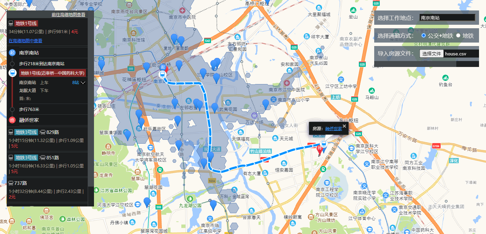

<p align="center">
  <a href="https://mehoon.com">
    
  </a>
  <br />
  <b>云淡风轻</b>
  <p align="center">高德地图-58租房爬虫</p>
  <p align="center">学习、分享</p>
  
  <p align="center">
  <a href="https://github.com/haohaizhi/haohaizhi.github.io/blob/main/assets/qq.jpg">
  </a>
  <a href="https://github.com/haohaizhi/58house_spiders/stargazers">
  </a>
  <a href="https://github.com/haohaizhi/58house_spiders/issues">
  </a>
</p>


<br />
<br />

# 项目简介
* 开始
```
# 拉取代码
git clone https://github.com/haohaizhi/58house_spiders.git

# 修改代码中url网址 (地区 价格范围)
# 如: 北京:bj.58.com
#     南京:nj.58.com
# 若想进行更准确的筛选，则需要添加其他参数，具体需要参考58同城
url = "https://nj.58.com/pinpaigongyu/pn/{page}/?minprice=2000_4000"
```
* 博客地址

[https://blog.mehoon.com/269.html](https://blog.mehoon.com/269.html)

* 程序运行后


```
# 需要爬取的信息主要是地名，以及网址，关键代码：

house_list = html.select(".list > li")

# BeautifulSoup 使用select方法详解
# 1、通过标签名查找
print soup.select('title') 

#[<title>The Dormouse's story</title>]
 
print soup.select('a')

#[<a class="sister" href="http://example.com/elsie" id="link1"><!-- Elsie --></a>, <a class="sister" href="http://example.com/lacie" id="link2">Lacie</a>, <a class="sister" href="http://example.com/tillie" id="link3">Tillie</a>]
 
print soup.select('b')

#[<b>The Dormouse's story</b>]


# 2、通过类名查找
print soup.select('.sister')

#[<a class="sister" href="http://example.com/elsie" id="link1"><!-- Elsie --></a>, <a class="sister" href="http://example.com/lacie" id="link2">Lacie</a>, <a class="sister" href="http://example.com/tillie" id="link3">Tillie</a>]


# 3、通过 id 名查找
print soup.select('#link1')

#[<a class="sister" href="http://example.com/elsie" id="link1"><!-- Elsie --></a>]


# 4、组合查找
# 组合查找即和写 class 文件时，标签名与类名、id名进行的组合原理是一样的，例如查找 p 标签中，id 等于 link1的内容，二者需要用空格分开
print soup.select('p #link1')

#[<a class="sister" href="http://example.com/elsie" id="link1"><!-- Elsie --></a>]

# 直接子标签查找
print soup.select("head > title")

#[<title>The Dormouse's story</title>]


# 5、属性查找
# 查找时还可以加入属性元素，属性需要用中括号括起来，注意属性和标签属于同一节点，所以中间不能加空格，否则会无法匹配到。
 print soup.select("head > title")

#[<title>The Dormouse's story</title>]
 
print soup.select('a[href="http://example.com/elsie"]')

#[<a class="sister" href="http://example.com/elsie" id="link1"><!-- Elsie --></a>]

# 同样，属性仍然可以与上述查找方式组合，不在同一节点的空格隔开，同一节点的不加空格
print soup.select('p a[href="http://example.com/elsie"]')

#[<a class="sister" href="http://example.com/elsie" id="link1"><!-- Elsie --></a>]
```
* Web显示


```
# 若想修改web显示的板块或者风格，可以参考高德API

# 点击房源超链接地址后将跳转到相应网址
```


